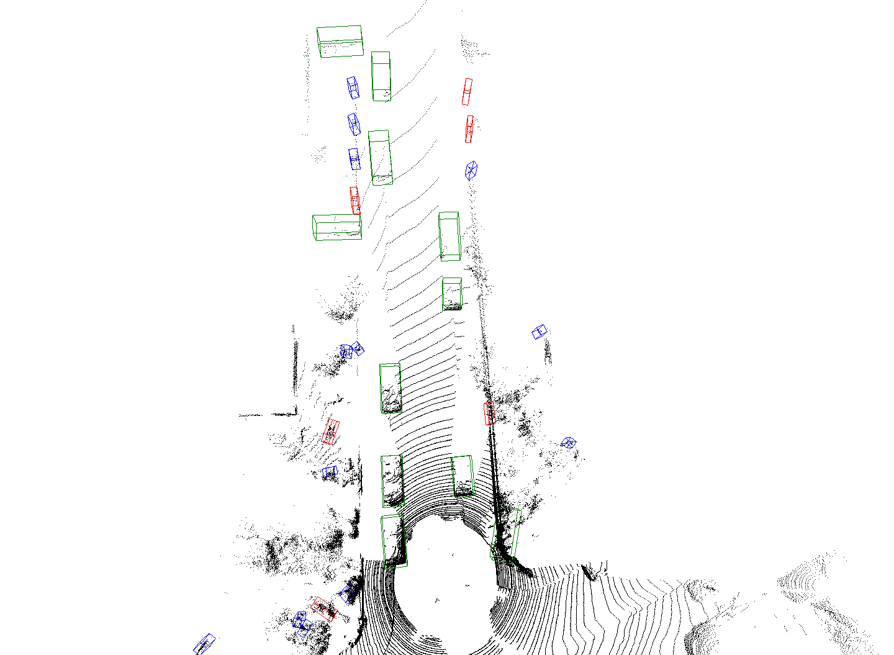
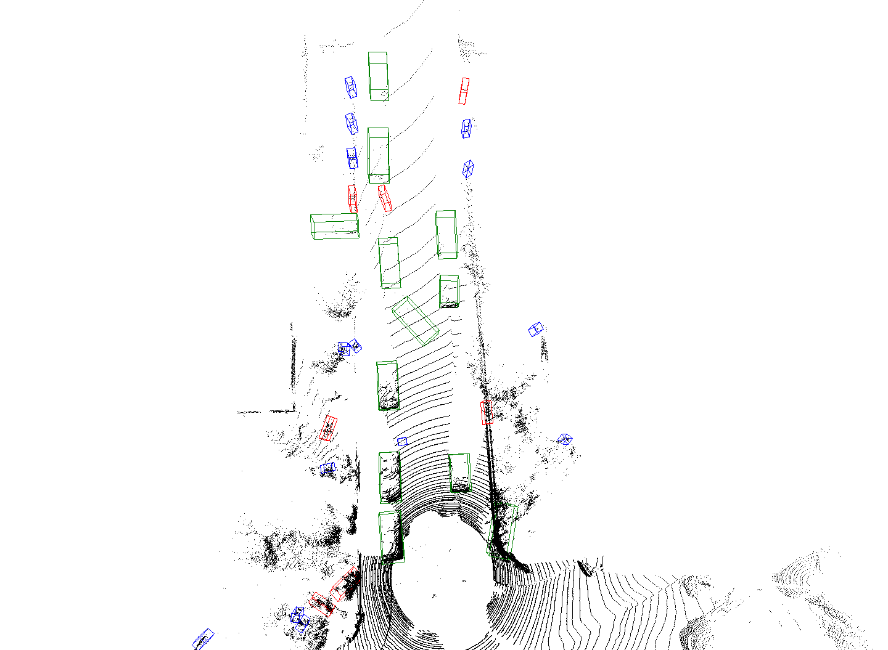

# ASP

This is the official repository of ASP[Attribution-based Scanline Perturbation Attack On 3D Detectors Of LiDAR Point Clouds]. The repository is based on [OccAM](https://github.com/dschinagl/occam).

The origin point cloud and perturbated sample is shown in the following figures.

##  Requirements

* linux(tested with Ubuntu 20.04 LTS)
* Python(tested with Ver.3.8)
* Cuda(tested with Ver.11.3)
* Spconv(tested with spconv-cu113 Ver.2.1.21)

## Instsall required packages
<code>pip install -r requirements.txt </code>

## Set up pcdet
<code>Python setup.py develop </code>

## Run demo
<code>Python demo.py </code>

## Citation
<code>
@INPROCEEDINGS{10447340,
  author={Yu, Ziyang and Yang, Ting and Chang, Qiong and Liu, Yu and Wang, Weimin},
  booktitle={IEEE International Conference on Acoustics, Speech and Signal Processing (ICASSP)}, 
  title={Attribution-Based Scanline Perturbation Attack on 3d Detectors of Lidar Point Clouds}, 
  year={2024},
  pages={4570-4574},
  doi={10.1109/ICASSP48485.2024.10447340}}
</code>

